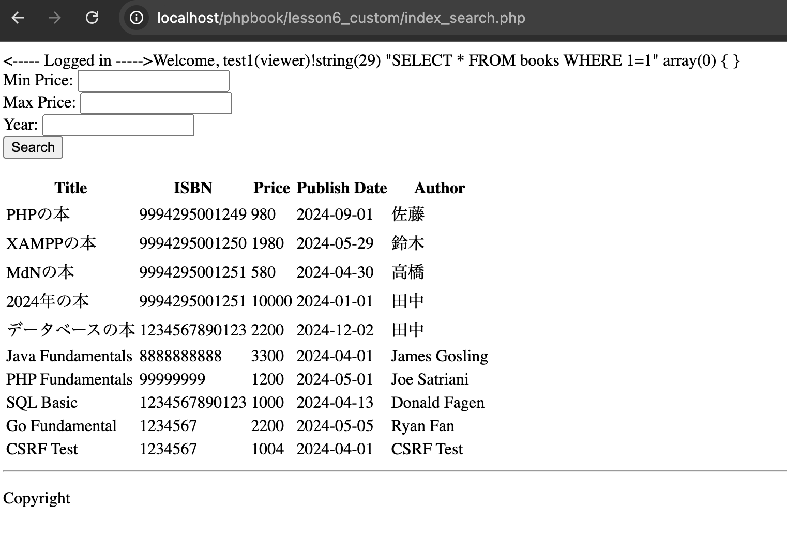
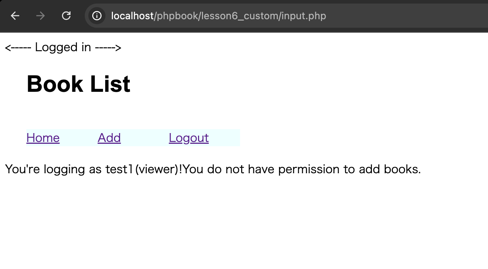
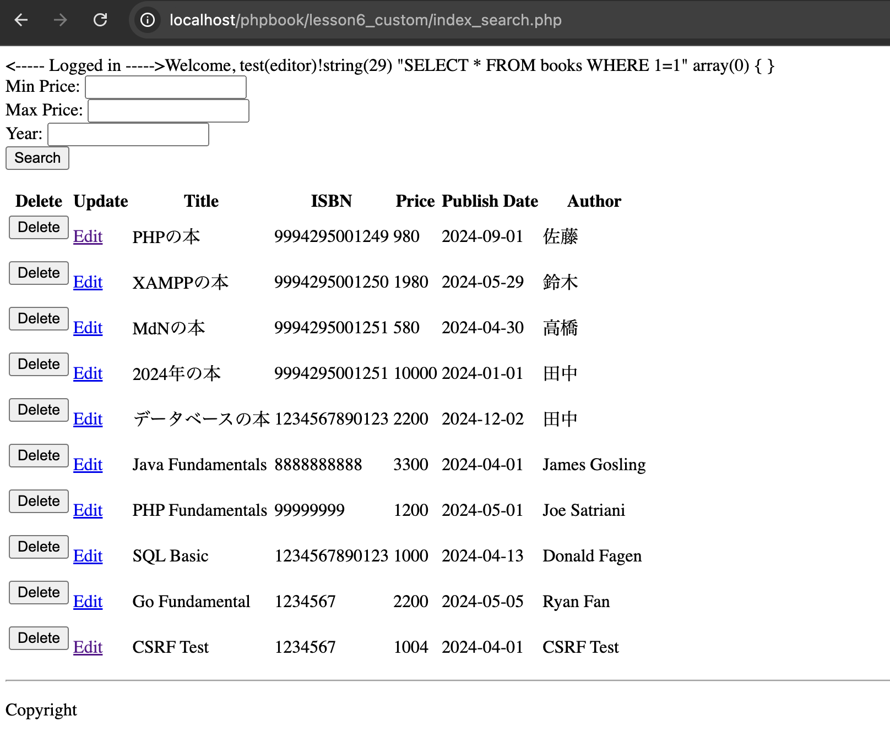
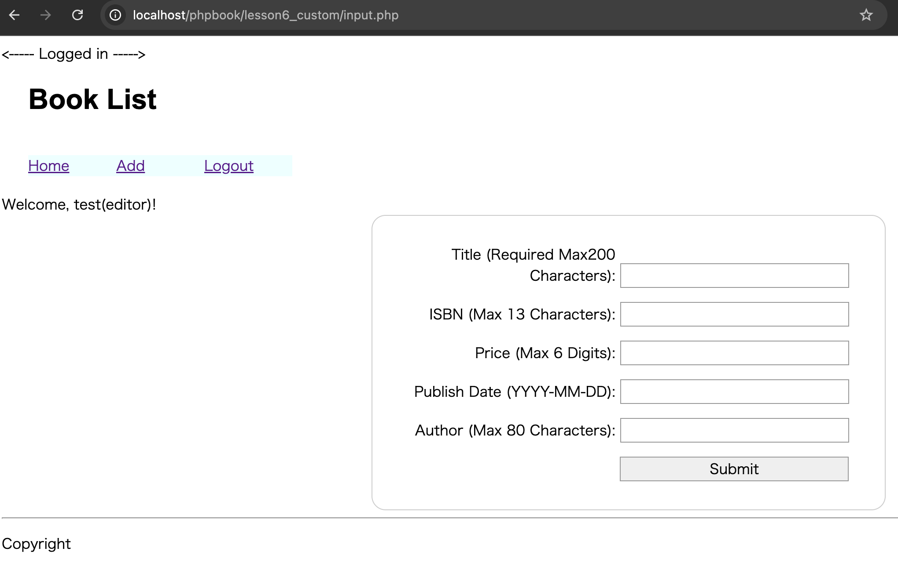

# Role-Based Access Control (RBAC) Screenshots for Book Management

This directory contains screenshots demonstrating the different test scenarios for the Role-Based Access Control (RBAC) system, specifically concerning book management functionalities.

## Viewer Role

These screenshots illustrate the behavior of a user with the "Viewer" role.

*   **View Book Information (`viewer_READ.png`):** Shows a viewer successfully accessing and viewing book information. This demonstrates the "read" permission for viewers. The "Delete" and "Edit" options should be hidden.
    

*   **Attempting to Access Add Book Functionality (`viewer_ADD.png`):** Shows a viewer attempting to access the functionality to add a book record by directly accessing the URL. This should result in a permission denied message: "You do not have permission to add books.", demonstrating the lack of "add" permission.
    

## Editor Role

These screenshots illustrate the behavior of a user with the "Editor" role.

*   **View Book Information (`editor_READ.png`):** Shows an editor successfully accessing and viewing book information. Editors should also have "read" access. The "Delete" and "Edit" options are displayed.
    

*   **Adding Book Record (`editor_ADD.png`):** Shows an editor successfully adding a book record. This demonstrates the "add" permission for editors. The screenshot should show the form used for adding the record, including relevant fields (e.g., Title, Author, ISBN, Price, Publish Date).
    