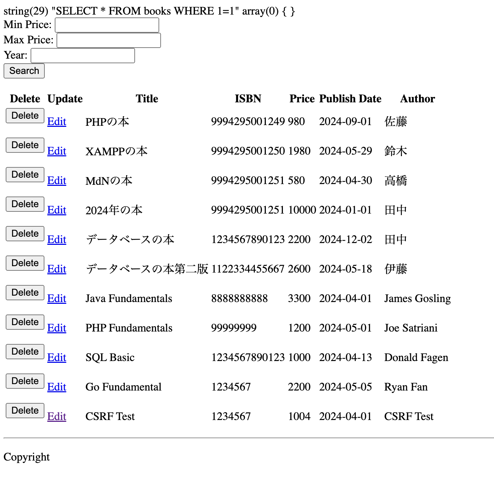
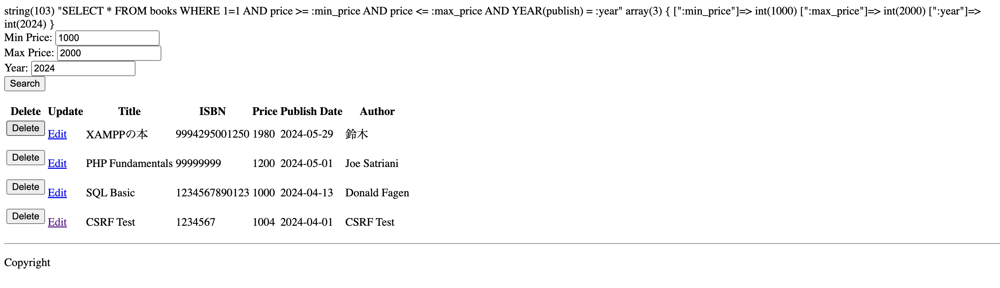
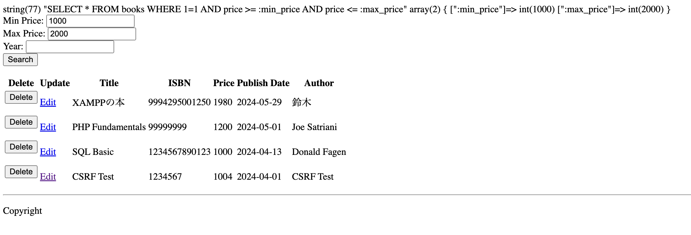
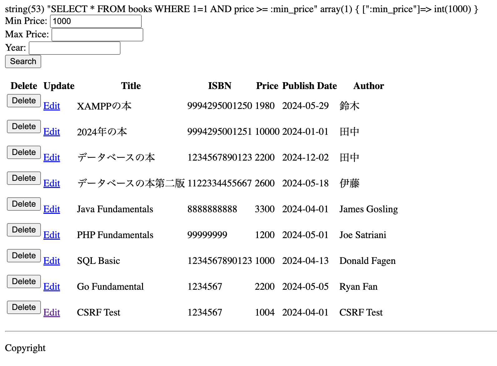
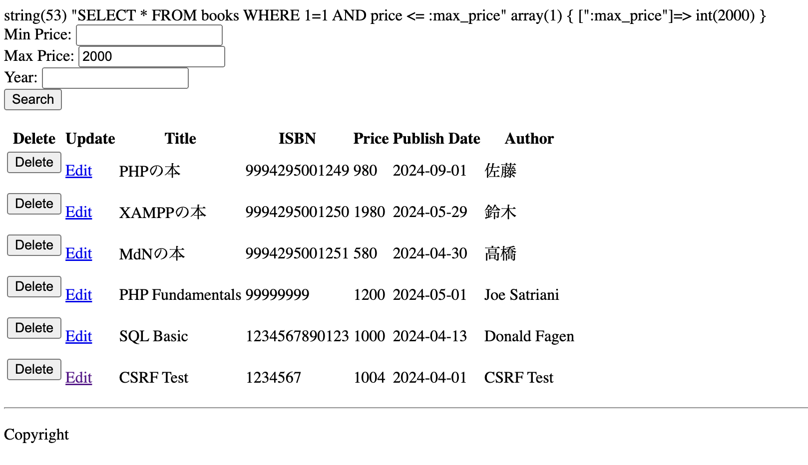
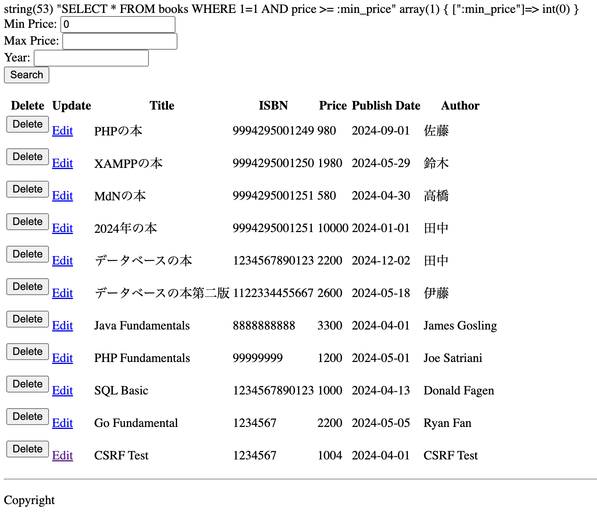
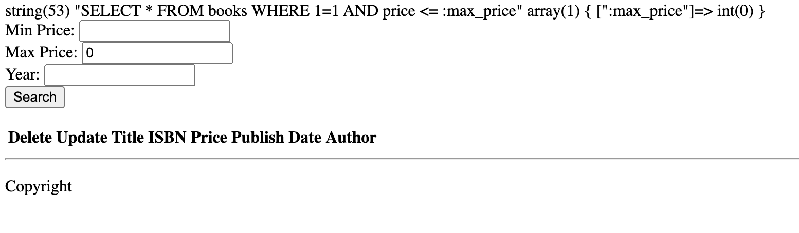
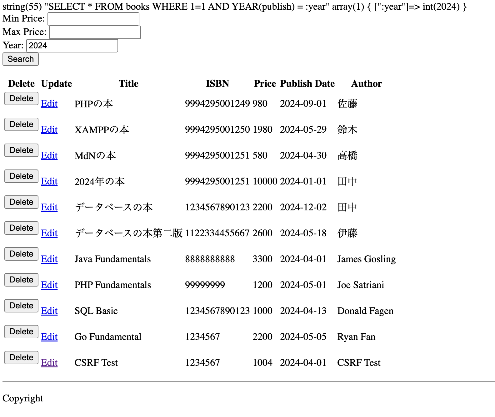
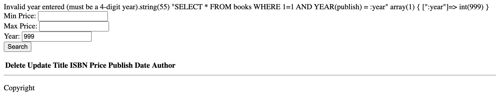

# Search Feature Screenshots

This directory contains screenshots demonstrating the different test scenarios for the search feature.

## Basic Search

These screenshots cover basic search functionality.

*   **Empty Input (`empty_saerch.png`):** Shows a behavior when search input is empty in all fields (price and year).
    
*   **All Valid Input (`all_fields_valid.png`):** Shows a successful search with valid input in all fields (price and year).
    

## Price Filtering

These screenshots demonstrate price filtering.

*   **Both Prices (`both_prices.png`):** Shows filtering with both minimum and maximum prices.
    
*   **Minimum Price Only (`min_price_only.png`):** Shows filtering with only a minimum price.
    
*   **Maximum Price Only (`max_price_only.png`):** Shows filtering with only a maximum price.
    
*   **Minimum Price zero (`min_price_zero.png`):** Shows filtering with a minimum price of 0, effectively showing all books regardless of price.
    
*   **Maximum Price zero (`max_price_zero.png`):** Shows filtering with a maximum price of 0, displaying only free books (if any).
    

## Year Filtering

These screenshots demonstrate year filtering.

*   **Specific Year (`specific_year.png`):** Shows filtering by a specific year (e.g., 2020).
    
*   **Invalid Year (`invalid_year.png`):** ** Shows the error message displayed when a non-4-digit year (e.g., "123") is entered.
    
